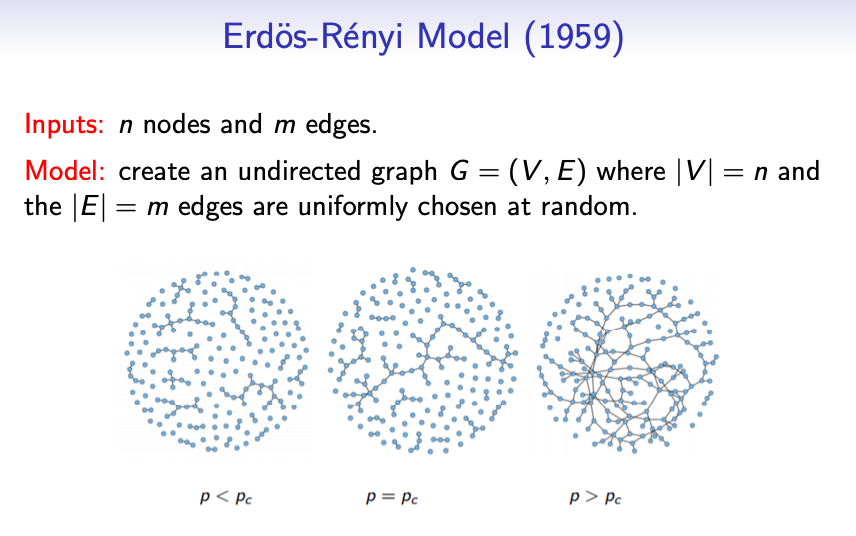
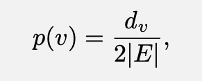
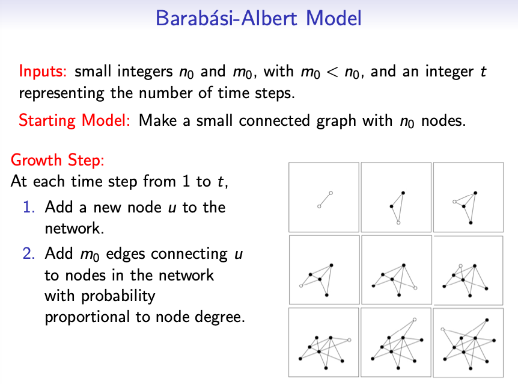
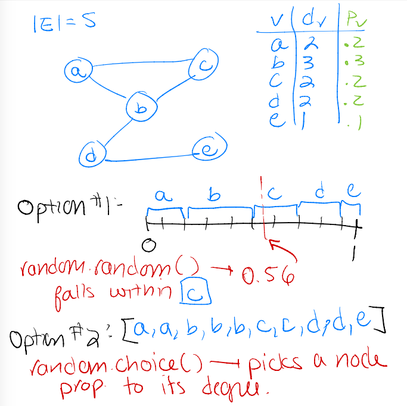
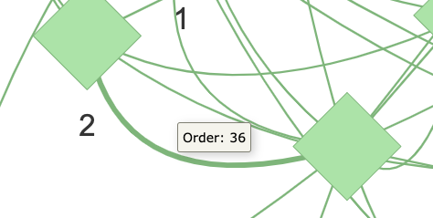
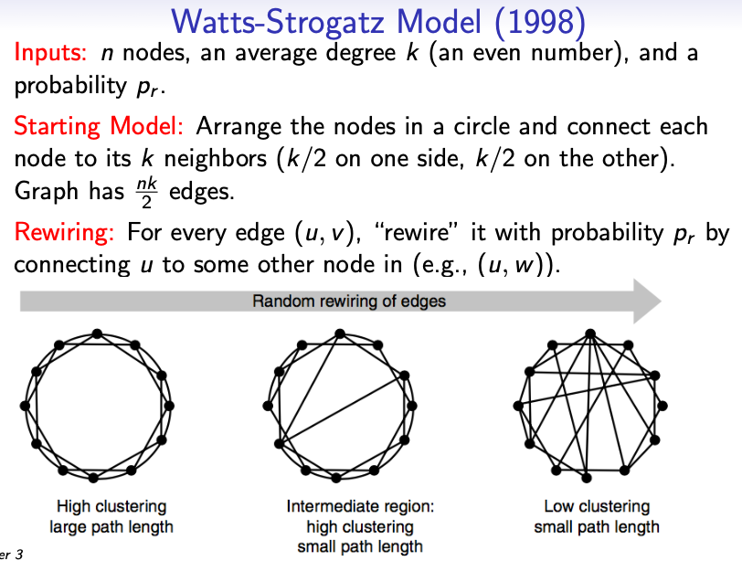

# L3: Random Graph Models

**Purpose:** This lab has three parts:
1. In small groups, you will write pseudocode for the Erdös-Rényi (ER) Model and the Barabási-Albert (BA) Model for generating random graphs.
2. You will implement both the ER Model and the BA Model.
3. You will visualize random graphs built from the two models.

Thre are no tests for this lab. Solutions for all labs are posted on Moodle.

**Labs are graded as Present / Absent:** To be counted as "present," you must submit whatever work you have done by the end of lab. Partial progress is fine - a solution will be posted to Moodle by Wednesday.

**Useful References:** Refer to the [GitHub Classroom CheatSheet](https://reed-compbio-classes.github.io/github-classroom-cheatsheet/) and the [Bio131 Python Crashcourse](https://reed-compbio-classes.github.io/python-crashcourse/).

**Resources and Collaborations:** You should document any online resources or collaborations in the `RESOURCES_COLLABORATIONS.txt` file. 
- :alien: [[AI policy](https://reed-compbio-classes.github.io/bio331-syllabus/doc/policies/#online-resources--generative-ai-policy)] Generative AI is allowed for basic Python syntax and to help debug, but you may not look up the code for entire functions that are part of an assignment or lab. 
- :computer: [[Resources policy](https://reed-compbio-classes.github.io/bio331-syllabus/doc/policies/#online-resources--generative-ai-policy)] Do not use python packages that provide code for working with graphs (e.g., networkx or igraph) or other math/stats packages (e.g., scipy or numpy) unless otherwise directed. 
- :handshake: [[Collaboration policy](https://reed-compbio-classes.github.io/bio331-syllabus/doc/policies/#collaboration-policy)] You are welcome to work with anyone on the labs and assignments, though you must write all of your own code. 

:white_check_mark: [AI Disclaimer] Claude was used to improve clarity. 

## Before You Begin

Before you start this (or any) lab or assignment, get your own copy of the repo and give me access to it:

1. On this repo's GitHub page, click the green **Use this template** button (near the top, next to "Code") and choose **Create a new repository**.
2. Set the **Owner** to your own GitHub account and set **Visibility** to **Private**. Keep the repository name the same as the template name. Click **Create repository**.
3. In your new repo (your username should be in the URL), go to **Settings -> Collaborators and teams -> Add people**, and invite `annaritz`. This is how I get access to see and give feedback on your work - without this step I can't see it.
4. Then, open your new repo in a GitHub Codespace or clone it locally; it may take a few minutes for the proper pieces to be installed the first time you open it in a Codespace. 

:bulb: Bookmark/star your own GitHub repositories page to find all your Bio331 repos in one place: go to your GitHub profile and click the **Repositories** tab (or go directly to `github.com/<your-username>?tab=repositories`). Your repos are private - that means that only you and I (once you've added me as a collaborator) can view them.

:question: If you don't see the "Use this template" button, or your invite to `annaritz` doesn't seem to work, let me know right away - I likely need to double check your access to the template repo.

:question: Forgot how to open your repo in a codespace, and submit your work when you're done? Refer to L1's instructions, which walks you through using a GitHub Codespace to make changes and submit work.

## Preliminaries: Descriptions of two Random Graph Models

### The Erdös-Rényi (ER) Model

Given two integers _n_ and _m_, the ER model generates an undirected graph _G=(V,E)_ where _|V|=n_ and _|E|=m_. The _m_ edges are chosen uniformly at random by selecting pairs of nodes. Do not add self loops or multiple edges that connect the same pair of nodes.



### The Barabási-Albert (BA) Model

The BA Model captures the "scale-free" characteristic found in most empirical networks. For this model, we are given two small integers _n\_0_ and _m\_0_, where _m\_0 < n\_0_, and a larger integer _t_.

Start with an initial small **connected** network with _n\_0_ nodes.  At each time step from 1 to _t_:
1. Add a new node _u_ to the network.
2. Add _m\_0_ edges connecting _u_ to already present nodes.  The probability _p(v)_ that an existing node _v_ is connected to _u_ (e.g., the edge _(u,v)_ is added to the network) is proportional to its degree _d\_v_:



where _|E|_ is the number of edges in the current network.



## 1. Write Pseudocode for the ER and BA Models

You will write pseudocode on the board for the ER and BA graph models. Pseudocode is language-independent code that gives an outline about how to implement something.  An algorithm should be straightforward to implement if you are given pseudocode, though some data structure decisions might still be left up to the person implementing the code.  Some things to consider:
1. What does each function take as input?
2. What does each function return?
3. In Part 2, you will learn about the ability to (a) randomly pick a `float` between 0 and 1 and (b) randomly pick an element from a list. You can use these as subroutines.

:exclamation: When you are satisfied with the pseudocode for the ER algorithm, check it with me before moving on to the BA algorithm.

:exclamation: When you are satisfied with the pseudocode for the BA algorithm, check it with me.

:bulb: There are a few ways to calculate the probability distribution _p(v)_ for the BA algorithm. One is to calculate a list of the cumulative distribution (values that range from 0 to 1) and then randomly select a number between 0 and 1; another is to maintain a list of all nodes with duplicates representing degree and randomly choose from that list. Here's a sketch of those two ideas on a toy network:



## 2. Write Code to Generate ER and BA Graph Models

Write code in `lab3.py` to implement the ER and BA graph models. There are no function stubs for these - **you** need to write the function definitions! Your functions should output two things: (a) a node list or a node set, and (b) an edge list, where edges are 2-element lists.  The nodes can be either integers or strings. 

:bulb: Start with the ER function. Once that is done, move on to the BA function.

:question: What should these functions be named? You get to decide!  Remember to _call_ your function from `main()` as you work on them.

:question: Having trouble getting started? Begin by generating a tiny graph (e.g., 4 nodes, 3 edges) and print every step.

### :bulb: The `random` Module

The `random` module will be helpful for implementing both graph models. Note that we have imported the module at the top of `lab3.py`. We call functions from this module in the following way:

1. `random.random()`: Return a random `float` between 0 and 1:
```
x = random.random() ## returns a float between 0 (incl.) and 1 (excl.)
```

2. `random.choice(myList)`: Return a random element from the list `myList`:
```
testList = ['A','B','C','D','E']
x = random.choice(testList) ## picks a random element from a list
```

:question: **How does a computer generate a random number?**  In fact, it doesn't! These are _pseudo-random_ numbers, but to us these are as good as truly random values. See [the documentation for the `random` Python module](https://docs.python.org/3/library/random.html) for more information.

:bulb: **It is difficult to debug code when the answer changes every time!** When you run your code, your computer generates a sequence of random numbers using the current time (which changes every time you run it!). Instead, you can set a _seed_, which is used to generate the sequence of random numbers.

To initialize the random seed generator, use `random.seed(A)` where `A` is an integer.  This means that the _order_ of random numbers will be the same each time you run your program, and can be useful for debugging.

## 3. Generate and Visualize Networks

The code already contains a `viz_graph()` function that takes a node list, an edge list, and a graph name and posts the graph. You can check that this function is working properly by calling it with some toy inputs from the `main()` function:

```
viz_graph([1,2,3],[[1,3],[2,3]],'toy.html')
```

Once you've implemented both algorithms:

1. Generate and visualize an **ER network** with 25 nodes and 100 edges.
2. Generate and visualize a **BA network** with an initial connected graph of `n0=3` nodes, `m0=1` edges, and `t=100` iterations added at each iteration. 
3. Generate and visualize a **BA network** with an initial connected graph of `n0=3` nodes, `m0=2` edges, and `t=50` iterations added at each iteration. 

Take a side-by-side look of these graphs and confirm your intuition about the differences between these random graph models. There is no additional work for this part, but make sure you understand the main differences between the two models.

:star: **NEW FEATURE** :star: You should be able to view the HTML directly in VSCode! Right click on the HTML file -> **Show Preview** and accept the port-forwarding prompt if one appears (especially in a Codespace).

:bulb: Sanity Check: Do all the nodes in your BA algorithm with `m0=2` edges have degree of at least 2? There should be no nodes with degree 1.

## Optional Extensions

If you have time, complete one or both of these extensions. 

### Optional Task A: Annotate the Graphs with the Edge Order

For both models, you iteratively add edges to the graph. Keep track of the order that you added edges, and add this as a `title` attribute when you call the `add_edge()` function in the visualization code. Then, when you hover over each edge, the value will pop up. You can format it nicely to print something like the following:



### Optional Task B: Implement the Watts-Strogatz Random Graph Model

This model requires building a structured graph, then rewiring the edges with a user-defined probability. Consider writing `build_initial_graph()` and `rewire_edge()` functions as subroutines. Visualize this graph (and optionally intermediate steps in the rewiring process).  



## Congratulations, you are done!

:star: Submit your work by _staging_, _committing_, and _syncing_ your changes to your repo. Remember to add any resources or collaborations in the `RESOURCES_COLLABORATIONS.txt` file before your final submission. Confirm that your last commit messages appear in your repo on GitHub.
